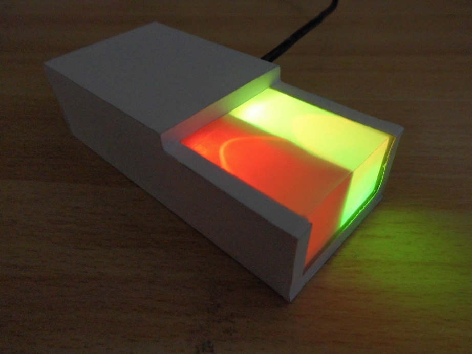
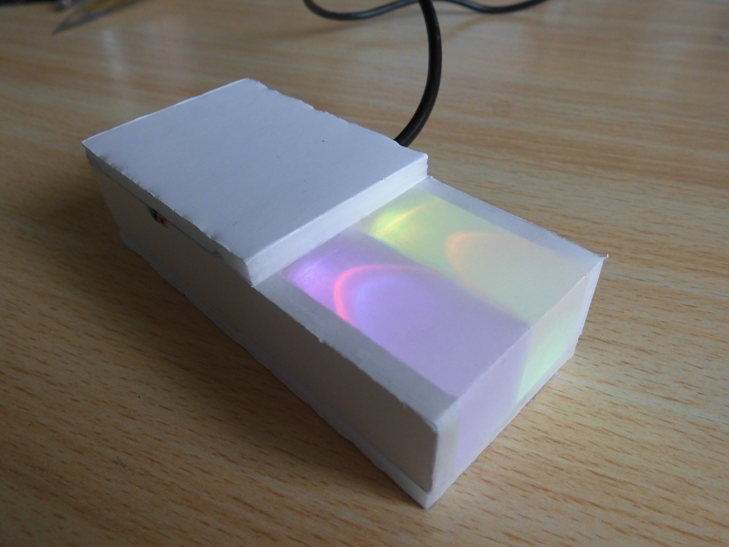
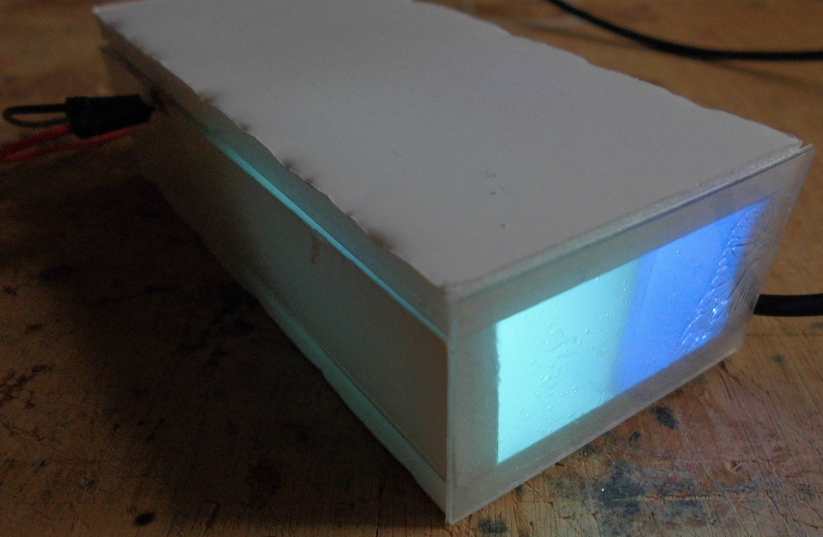
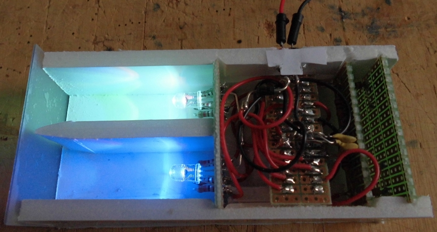
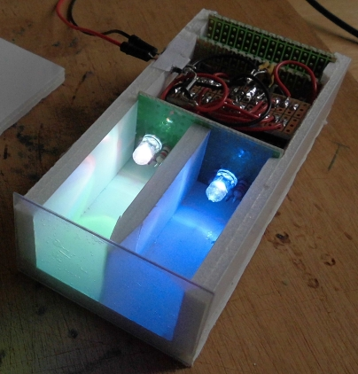
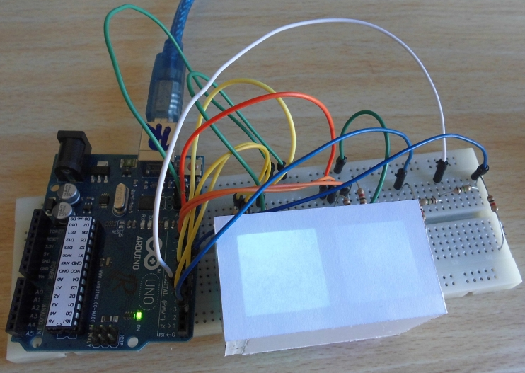
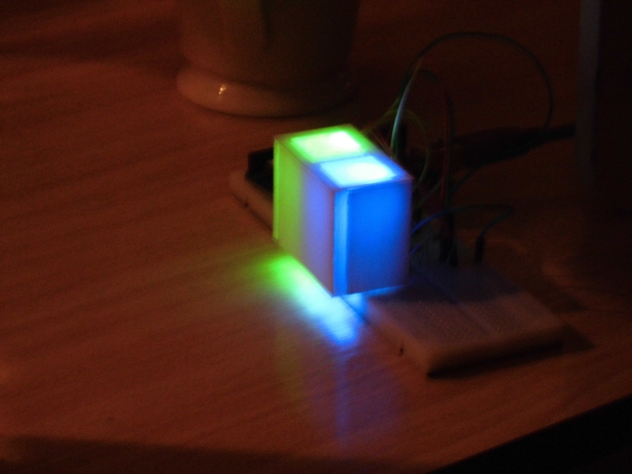
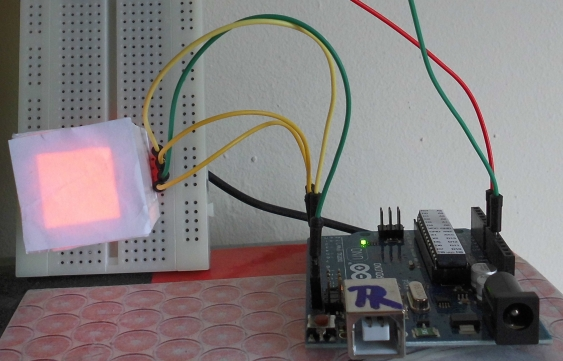

# ApproxyClock

Clock that gives correct time, that can only be approximated

All the files you need:

 * [Arduino code](ApproxyClock/ApproxyClock.ino)
 * [Fritzing schematic](ApproxyClock.fzz)
 * [Etch copper bottom](ApproxyClock_etch_copper_bottom.pdf)
 * [Etch copper bottom, mirrored](ApproxyClock_etch_copper_bottom_mirror.pdf)
 * [Etch copper top](ApproxyClock_etch_copper_top.pdf)
 * [Etch copper top, mirrored](ApproxyClock_etch_copper_top_mirror.pdf)
 * [Paper casing](ApproxyClockPaperCasing.dxf) to be wrapped around the 5mm thick foamboard

You can also read the [FAQ](FAQ.md).
 
## Pictures

Ordered from new to old

### 2015-04-08: Start with PCB

[ApproxyClock PCB 2015-04-08](ApproxyClockPcb1.jpg)
[ApproxyClock PCB 2015-04-08](ApproxyClockPcb2.jpg)

### 2015-04-06: Wrapped a paper casing around it:

### 2015-04-06: Added an extra cut-out

### 2015-03-29: Assembled version

### 2015-03-29: Peek into inside before assemblage

### 2015-03-22: Prototype 3: Added touch sensors

### 2015-03-22: Prototype 2: Added rainbow time

### 2015-03-21: Prototype 1

